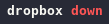
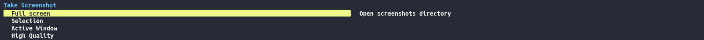

# [dotfiles](https://dotfiles.github.io)

These are my dotfiles! I am using these files currently on [Manjaro Linux](https://manjaro.org). So these files should work on [Arch Linux based distros](https://wiki.archlinux.org/index.php/Arch-based_distributions#Active). I didn't test the `Make` file yet. So use it on your own risk.
Below you will find a couple of screenshots and more details which programs I use on my machine.

## Install

```shell
cd ~
git clone http://github.com/volcain-io/dotfiles.git .dotfiles
cd .dotfiles && make
```

## Screenshots

### Three monitor setup

This is actual my setup at home with three monitors in total.

Left monitor is connected via HDMI. Right monitor via VGA.
Middle screen is my laptop monitor, which is also the main screen.

<a href="screenshots/desktop-full-three-monitors.png" target="_blank"></a>

### Main screen


## Network

### WiFi

Setup of connecting and disconnecting to a WiFi network is pretty simple and straightforward.
I simply start `nmtui-connect` on `left mouse click` and the terminal opens up to configure my network connection.
See `[module/wifi]` inside polybar config file for more details.


### Wireguard

The flag inside polybar turns on/off accordingly to show me the status of wireguard. I use a simple script to start/stop wireguard (`wg-status` inside the `localbin` folder), which needs to run as `sudo`.
Therefore the script will prompt for `sudo` password, if you want to start or stop the service.

| State | Description          | Screenshot                                      | How To                                                                                                   |
|-------|----------------------|-------------------------------------------------|----------------------------------------------------------------------------------------------------------|
| On    | Service is running.  |    | Left mouse click on <span style="color:#ff5555;background-color:#1e2029;padding:1px 5px;">**off**</span> |
| Off   | Service not running. |  | Right mouse click on <span style="color:#50fa7b;background-color:#1e2029;padding:1px 5px;">**on**</span> |

## Battery

There three states for tracking the battery state.

| State       | Description                                                          | Screenshot                                                  |
|-------------|----------------------------------------------------------------------|-------------------------------------------------------------|
| Charging    | Battery is charging. Animate text from left to right.                |        |
| Discharging | System is running on battery power. Animate text from right to left. |  |
| Full        | Battery fully loaded. No animation.                                  |                |

## Dropbox

A custom script checks periodically the state of dropbox.

| State   | Description                              | Screenshot                                          |
|---------|------------------------------------------|-----------------------------------------------------|
| Down    | Dropbox isn't running. Daemon down.      |        |
| Dead    | Dropbox isn't responding.                |        |
| Syncing | Files are being indexed and synchronized |  |
| In sync | All files are in sync.                   |  |

## Notifications


## Programs

### Default Programs (=must haves)

|                     | Name                                                            |
|---------------------|-----------------------------------------------------------------|
| Shell               | [Zsh](https://www.zsh.org/)                                     |
| Zsh Framework       | [Oh-My-Zsh](https://github.com/robbyrussell/oh-my-zsh/)         |
| Window Manager      | [i3-gaps](https://github.com/Airblader/i3)                      |
| Terminal            | [termite](https://github.com/thestinger/termite)                |
| Status Bar          | [polybar](https://github.com/polybar/polybar)                   |
| AUR Helper          | [yay](https://github.com/Jguer/yay)                             |
| App Launcher        | [rofi](https://github.com/davatorium/rofi)                      |
| System Info         | [ufetch](https://gitlab.com/jschx/ufetch)                       |
| Text Editor         | [vim](https://github.com/vim/vim)                               |
| Code/Org Editor     | [Spacemacs](https://github.com/syl20bnr/spacemacs/tree/develop) |
| Notifications       | [dunst](https://github.com/dunst-project/dunst)                 |
| Screenshot          | [maim](https://github.com/naelstrof/maim)                       |
| Image Viewer        | [sxiv](https://github.com/muennich/sxiv)                        |
| Image Viewer        | [feh](https://github.com/derf/feh)                              |
| Video Player        | [mpv](https://github.com/mpv-player/mpv)                        |
| PDF Reader          | [mupdf](https://github.com/ArtifexSoftware/mupdf)               |
| Password Manager    | [pass](https://www.passwordstore.org/)                          |
| Browser (main)      | [Firefox](https://www.mozilla.org/en-US/firefox/)               |
| Browser (secondary) | [Chromium](https://www.chromium.org/Home)                       |
| Git browser         | [tig](https://github.com/jonas/tig)                             |
| Mail                | [Thunderbird](https://www.thunderbird.net/en-US/)               |
| Cloud Storage       | [Dropbox](https://www.dropbox.com)                              |
| Image Editor        | [GIMP](https://www.gimp.org/)                                   |
| Vector Processing   | [Inkscape](https://inkscape.org/)                               |
| WYSIWYG Publishing  | [Scribus](https://www.scribus.net/)                             |
| RSS Client          | [newsboat](https://github.com/newsboat/newsboat)                |
| Document Converter  | [pandoc](https://github.com/jgm/pandoc)                         |

### Alternatives (=better defaults)

| Original    | Alternative                                                | Usage      |
|-------------|------------------------------------------------------------|------------|
| grep        | [ripgrep](https://github.com/BurntSushi/ripgrep)           | Evaluating |
| cat         | [bat](https://github.com/sharkdp/bat)                      | Fully      |
| find        | [fd](https://github.com/sharkdp/fd)                        | Evaluating |
| ls          | [exa](https://github.com/ogham/exa)                        | Evaluating |
| notify-send | [dunstify](https://github.com/dunst-project/dunst)         | Fully      |
| git diff    | [diff-so-fancy](https://github.com/so-fancy/diff-so-fancy) | Fully      |
| top         | [htop](https://github.com/hishamhm/htop)                   | Fully      |
| man         | [tldr](https://github.com/tldr-pages/tldr)                 | Partly     |

### Optional Programs (=nice to have)

|                    | Name                                                 |
|--------------------|------------------------------------------------------|
| Flash OS images    | [etcher](https://github.com/balena-io/etcher)        |
| MAC Changer        | [macchanger](https://github.com/shilch/macchanger)   |

### Extras

|                  | Name                                                                    |
|------------------|-------------------------------------------------------------------------|
| Font (main)      | [Hack](https://github.com/source-foundry/Hack)                          |
| Font (Spacemacs) | [Adobe Source Code Pro](https://github.com/adobe-fonts/source-code-pro) |
| Font (Powerline) | [Powerline Fonts](https://github.com/powerline/fonts)                   |
| Zsh Theme        | [Spaceship](https://github.com/denysdovhan/spaceship-prompt)            |
| VIM Config       | [Ultimate Vim Configuration](https://github.com/amix/vimrc)             |

## Config

### i3

* no auto login
* disabled login manager (lightdm)
* `$mod+c` opens clipboard manager
* `$mod+p` opens password manager
* `$mod+0` opens session menu
* `$mod+Print` opens screenshot menu

### Wallpaper

The script **[set-wallpaper](localbin/set-wallpaper)** sets randomly the wallpapers on start. It can be invoked from the command line, too. The script checks, how many monitors are connected and chooses randomly a wallpaper for each monitor. To set the wallpaper on each monitor **[feh](https://github.com/amix/vimrc)** is used. The wallpapers are stored inside the **[wallpapers](wallpapers)** directory.

### Taking Screenshots

Custom Script: **[take-screenshot](localbin/take-screenshot)**



### Power Management

Custom Script: **[session-menu](localbin/session-menu)**


